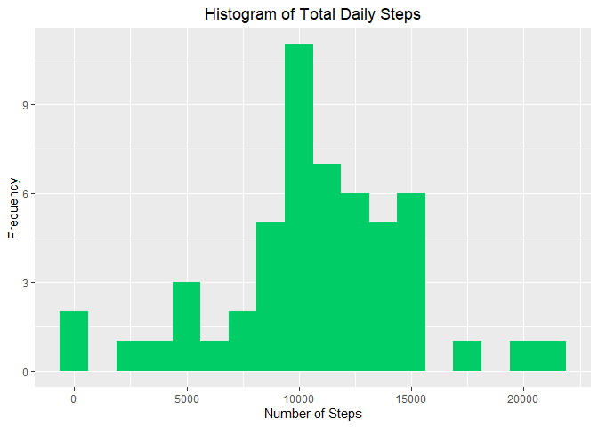
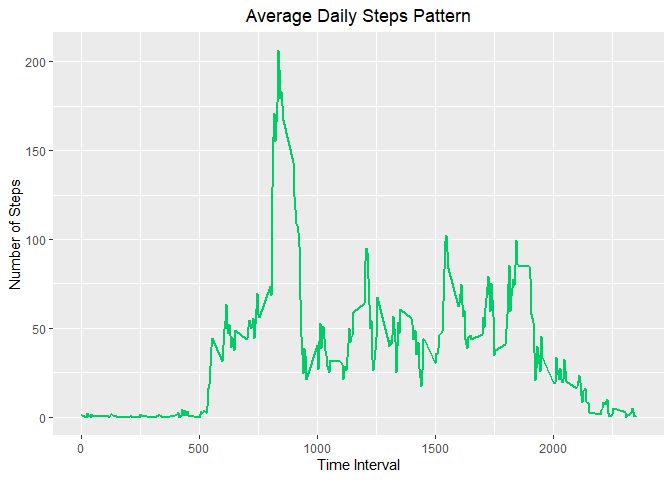
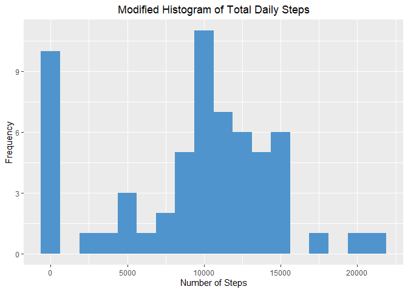
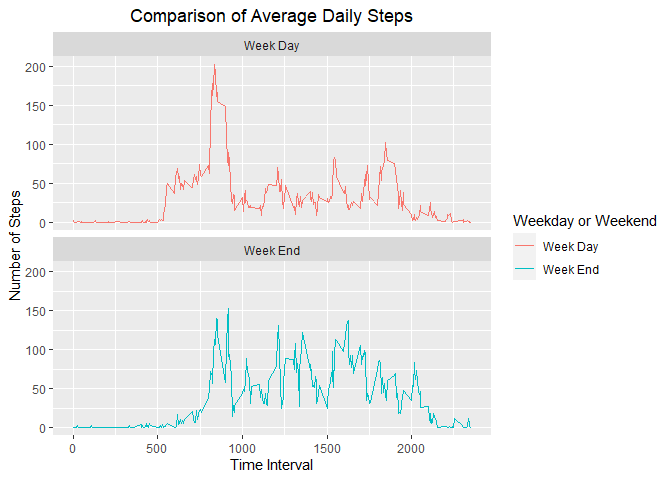

## Loading and preprocessing the data

Download the activity monitoring data and retrieve its .csv file.


```r
# Load all the relevant library to the Project 
library(ggplot2)
library("data.table")

# Download and unzip the activity monitoring data
download.file("https://d396qusza40orc.cloudfront.net/repdata%2Fdata%2Factivity.zip", destfile = paste0(getwd(), '/repdata%2Fdata%2Factivity.zip'), mode="wb")
unzip("repdata%2Fdata%2Factivity.zip",exdir = "fitness-data")

# Read the .csv data and assign into a Data table
activityData <- data.table::fread(input = "fitness-data/activity.csv")
```

## What is mean total number of steps taken per day?

Calculating the total number of steps taken each day and showing the first ten entries of the data table.


```r
stepsTotal <- activityData[, c(lapply(.SD, sum, na.rm = FALSE)), .SDcols = c("steps"), by = .(date)] 

# View the first ten entries of the data table
head(stepsTotal, 10)
```

```
##           date steps
##  1: 2012-10-01    NA
##  2: 2012-10-02   126
##  3: 2012-10-03 11352
##  4: 2012-10-04 12116
##  5: 2012-10-05 13294
##  6: 2012-10-06 15420
##  7: 2012-10-07 11015
##  8: 2012-10-08    NA
##  9: 2012-10-09 12811
## 10: 2012-10-10  9900
```

Constructing a histogram of the total number of steps taken each day. 


```r
ggplot(stepsTotal, aes(x = steps)) +
    geom_histogram(fill = "springgreen3", binwidth = 1250) +
    labs(x = "Number of Steps", y = "Frequency") +
    ggtitle("Histogram of Total Daily Steps") +
    theme(plot.title = element_text(hjust = 0.5))
```

```
## Warning: Removed 8 rows containing non-finite values (stat_bin).
```

<!-- -->

Calculating for the mean and median of the total number of steps taken per day.

```r
stepsTotal[, .(MeanSteps = mean(steps, na.rm = TRUE), 
               MedianSteps = median(steps, na.rm = TRUE))]
```

```
##    MeanSteps MedianSteps
## 1:  10766.19       10765
```

## What is the average daily activity pattern?

Constructing a time series plot of the 5-minute interval and the average number of steps taken, averaged across all days


```r
fiveminIntdata <- activityData[, c(lapply(.SD, mean, na.rm = TRUE)), .SDcols = c("steps"), by = .(interval)] 
ggplot(fiveminIntdata, aes(x = interval , y = steps)) + 
  geom_line(color="springgreen3", size=1) + 
  labs(x = "Time Interval", y = "Number of Steps") +
  ggtitle("Average Daily Steps Pattern") +
  theme(plot.title = element_text(hjust = 0.5))
```

<!-- -->

Determining which 5-minute interval, on average across all the days in the data set, contains the maximum number of steps?


```r
fiveminIntdata[steps == max(steps), .(maxInterval = interval)]
```

```
##    maxInterval
## 1:         835
```

## Imputing missing values

Determining the total number of missing values in the data set (i.e. the total number of rows with 𝙽𝙰s)


```r
activityData[is.na(steps), .N ]    # alternatively, nrow(activityData[is.na(steps),])
```

```
## [1] 2304
```

Using the median of the data set to supply for the missing values. 


```r
activityData[is.na(steps), "steps"] <- activityData[, c(lapply(.SD, median, na.rm = TRUE)), .SDcols = c("steps")]
```

Creating a new data set after the missing values were supplied


```r
data.table::fwrite(x = activityData, file = "fitness-data/modifiedData.csv", quote = FALSE)
```

Repeating the previous steps on the new data set to determine the effect of the supplied missing values.


```r
stepsTotalmodified <- activityData[, c(lapply(.SD, sum, na.rm = FALSE)), .SDcols = c("steps"), by = .(date)] 
```

Plotting the new histogram of the total number of steps taken each day. 


```r
ggplot(stepsTotalmodified, aes(x = steps)) +
    geom_histogram(fill = "steelblue3", binwidth = 1250) +
    labs(x = "Number of Steps", y = "Frequency") +
    ggtitle("Modified Histogram of Total Daily Steps") +
    theme(plot.title = element_text(hjust = 0.5))
```

<!-- -->

Calculating for the modified mean and median of the total number of steps taken per day.

```r
stepsTotalmodified[, .(MeanStepsModified = mean(steps, na.rm = TRUE), 
               MedianStepsModified = median(steps, na.rm = TRUE))]
```

```
##    MeanStepsModified MedianStepsModified
## 1:           9354.23               10395
```
Comparing it back from the original data, it can be seen that replacing the missing values with the median, decreased the value of the mean and median of the total number of steps taken each day.

```r
stepsTotal[, .(MeanSteps = mean(steps, na.rm = TRUE), 
               MedianSteps = median(steps, na.rm = TRUE))]
```

```
##    MeanSteps MedianSteps
## 1:  10766.19       10765
```

## Are there differences in activity patterns between weekdays and weekends?

Creating a new factor variable that classifies each day either weekday or weekend 

```r
weekDayEnd <- data.table::fread(input = "fitness-data/activity.csv")
weekDayEnd[, date := as.POSIXct(date, format = "%Y-%m-%d")]
weekDayEnd[, `Day of Week`:= weekdays(x = date)]
weekDayEnd[grepl(pattern = "Monday|Tuesday|Wednesday|Thursday|Friday", x = `Day of Week`), "Weekday or Weekend"] <- "Week Day"
weekDayEnd[grepl(pattern = "Saturday|Sunday", x = `Day of Week`), "Weekday or Weekend"] <- "Week End"
weekDayEnd[, `weekday or weekend` := as.factor(`Weekday or Weekend`)]
```

Constructing a panel plot containing the time series plot of the 5-minute interval and the average number of steps taken, averaged across all weekdays and weekends.


```r
weekDayEnd[is.na(steps), "steps"] <- weekDayEnd[, c(lapply(.SD, median, na.rm = TRUE)), .SDcols = c("steps")]
fiveminInt <- weekDayEnd[, c(lapply(.SD, mean, na.rm = TRUE)), .SDcols = c("steps"), by = .(interval, `Weekday or Weekend`)] 
ggplot(fiveminInt , aes(x = interval , y = steps, color=`Weekday or Weekend`)) + 
  geom_line() + labs(x = "Time Interval", y = "Number of Steps") + 
  facet_wrap(~`Weekday or Weekend` , ncol = 1, nrow=2) +
  ggtitle("Comparison of Average Daily Steps") +
  theme(plot.title = element_text(hjust = 0.5))
```

<!-- -->
